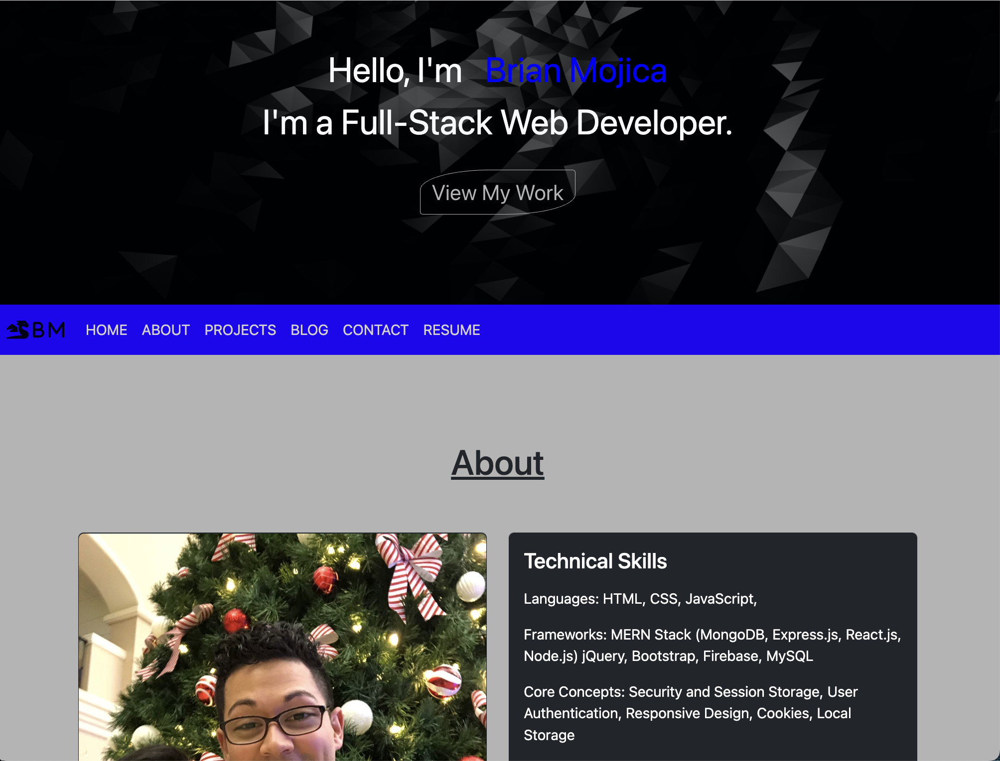

# Brian Mojica's Portfolio

## Table of Contents
- [Description](#Description)
- [Installation](#Installation)
- [Usage](#Usage)
- [Credits](#Credits)
- [License](#License)

## Description

### Motivation/Purpose

This Is my Portfolio that I hope can be inspiration for other fellow coders. This application is not 100% complete. As I continue to sharpen my skills and passion for thoughtful UI effects, animation and creating an intuitive dynamic user experiences my applications will be updated. 

### My Insight  Gained

I learned alot creating this portfolio I was able to input and practice a set of different skills such as:
- Use different classes to target specific HTML elements to adjust its properties. 
- Use CSS selectors to adjust what is contained in my elements. 
- Make a grid for different objects such as my images/cards.
- Create and utilize flexboxes.
- Create and use media queries. 

## Installation
No installation necessary simply click on the following link to view the deployed website:
https://github.com/Brainybrian316/Portfolio

## Usage
My portfolio to showcase my skills and different projects I am working on.

## Credits
- Solo project and no other contributors

## License

Website not currently licensed.

